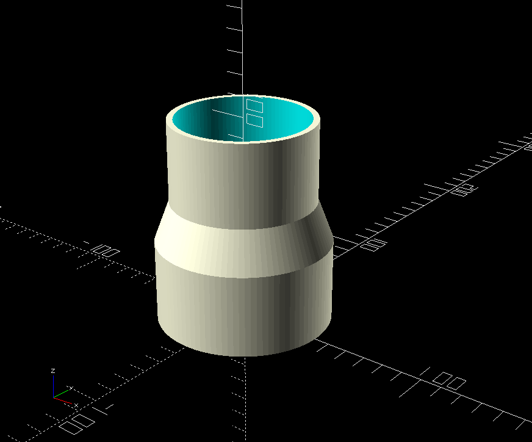
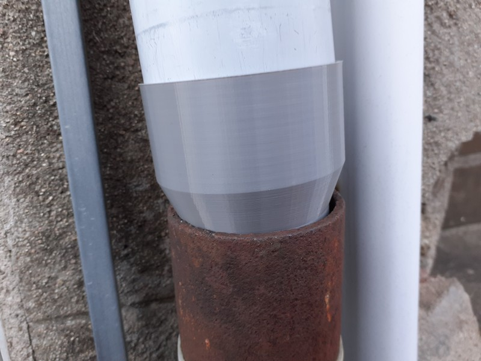

# Straight pipe reducer fitting

It's simply a configurable pipe connection.

You can change small et big diameters, length of each section, and global thickness.

Also available on [Thingiverse](https://www.thingiverse.com/thing:6541529)

